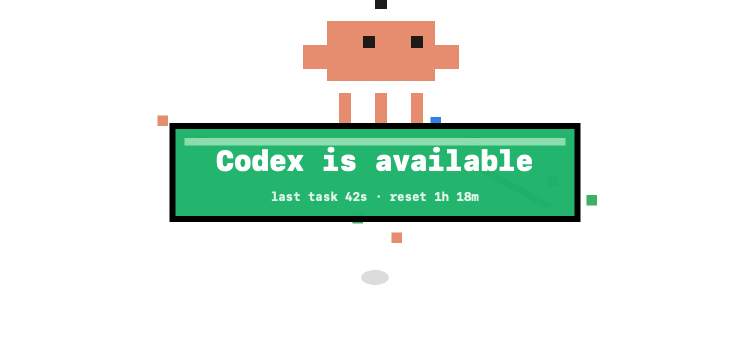
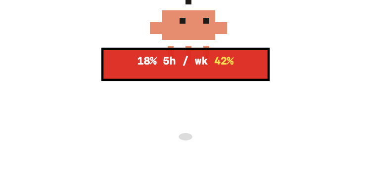

<div align="center">

# LimitDude

LimitDude is a tiny macOS menu bar companion for Codex limits, long-running tasks, and the tiny human need to know when Codex is ready again.




</div>

> **Note**
> LimitDude is a local, unsigned macOS build in active development. It is made for people who use Codex on their own Mac and want a lightweight signal when a task finishes or limits change.

## Install

### Manual Installation

Build the macOS app bundle:

```bash
scripts/build-app.sh
```

Open the build output:

```bash
open dist
```

Move `LimitDude.app` into `/Applications`, or run it directly from `dist/`.

Because this is an unsigned local build, macOS may ask you to allow it in **System Settings -> Privacy & Security** the first time you open it.

## Features/Roadmap

### Codex task watching

- [x] Watch active Codex tasks from local Codex state.
- [x] Show a **Codex is available** overlay when a long task finishes.
- [x] Ignore quick answers so short replies do not spam the screen.
- [x] Show how long the last completed task ran.
- [ ] Add user-configurable thresholds for what counts as a long task.
- [ ] Add launch-at-login support.

### Limit awareness

- [x] Read current Codex limits from the local Codex app-server protocol.
- [x] Show 5-hour and weekly remaining percentages.
- [x] Color percentages red, yellow, or green for quick scanning.
- [x] Warn when Codex usage is near the limit.
- [x] Detect limit reset/recovery moments.
- [ ] Add a compact history view for recent limit changes.

### Menu bar utility

- [x] Native macOS menu bar item.
- [x] Manual **Check Codex Now** action.
- [x] Manual overlay demos for task done, warnings, limited state, and reset.
- [x] **Connection Setup** diagnostics for new Macs.
- [ ] Add a signed and notarized release flow.
- [ ] Add a Homebrew cask once releases are stable.

## Gallery

#### Task finished


#### Limit warning



The README animations are rendered from the same `PixelDudeView` code used by the app, so the GIFs stay in sync with the real overlay.

## Developer Commands

Build the Swift package:

```bash
swift build
```

Run from source:

```bash
swift run LimitDude
```

Run core checks:

```bash
swift run LimitDudeCoreChecks
```

Check Codex limits once:

```bash
swift run LimitDudeCodexCheck
```

Show the task-done overlay demo:

```bash
swift run LimitDude --demo-task-done
```

Show the warning overlay demo:

```bash
swift run LimitDude --demo-warning --demo-click
```

Regenerate README GIF assets:

```bash
swift run LimitDude --render-readme-assets
```

## How It Works

LimitDude is split into three Swift targets:

- `LimitDudeCore` models limit readings, reset/recovery detection, task completions, and setup reports.
- `LimitDudeMac` reads local Codex app and task state from macOS.
- `LimitDude` owns the AppKit menu bar app, overlay window, demo modes, and README asset renderer.

The overlay is a transparent borderless AppKit window drawn by `PixelDudeView`. The same drawing code powers the running app and the generated README GIFs.

## Privacy

LimitDude runs locally on your Mac. It does not use external services.

For Codex limits, LimitDude uses the local session from your installed Codex.app. It does not ask for your password or API key. Open Codex.app, sign in there, then use **Connection Setup** from the LimitDude menu to verify that limits are readable.

It expects Codex.app to be installed at:

```text
/Applications/Codex.app
```

The task watcher reads local Codex state from:

```text
~/.codex/state_5.sqlite
```

## Troubleshooting

If the menu bar item appears but no useful status shows up, open **Connection Setup** from the LimitDude menu. It checks whether Codex is installed where LimitDude expects it, whether your local Codex session can read rate limits, and whether the local Codex state file is available.

If macOS blocks launch, open **System Settings -> Privacy & Security** and allow the unsigned app build.

## License

LimitDude does not currently declare a license.
