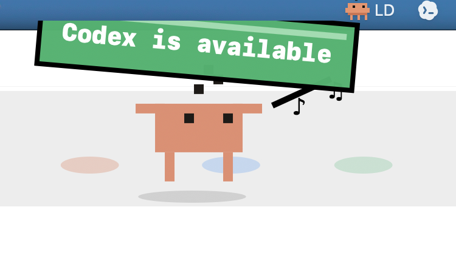
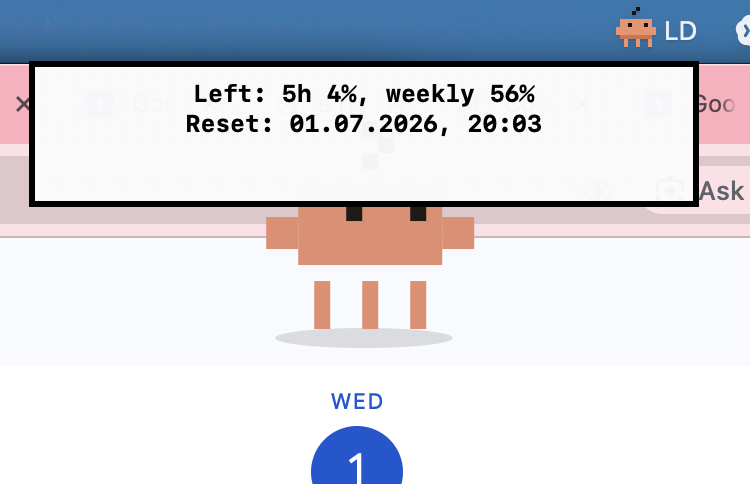

# LimitDude

Tiny macOS menu bar companion for Codex limits, long-running tasks, and the small emotional need to know when Codex is ready again.



## What It Does

LimitDude watches Codex from the menu bar and shows a pixel character overlay when something needs attention.

- Checks Codex rate limits from the local Codex app-server protocol.
- Shows current 5-hour and weekly remaining percentages.
- Colors remaining percentages: red for low, yellow for medium, green for healthy.
- Warns when Codex usage is near the limit.
- Watches active Codex tasks and shows `Codex is available` when a long task finishes.
- Ignores quick answers so short replies do not spam the screen.
- Shows how long the last completed task ran.
- Includes `Setup Status` to explain what is missing on a new Mac.
- Provides menu actions for manual checks and demo overlays.



## Install Locally

Build the macOS app bundle:

```bash
scripts/build-app.sh
```

Then install it:

```bash
open dist
```

Drag `LimitDude.app` into `/Applications`, or run it directly from `dist/`.

This is a local unsigned build. macOS may ask you to allow it in System Settings -> Privacy & Security the first time you open it.

## Developer Commands

Build the Swift package:

```bash
swift build
```

Run from source:

```bash
swift run LimitDude
```

Run core checks:

```bash
swift run LimitDudeCoreChecks
```

Check Codex limits once:

```bash
swift run LimitDudeCodexCheck
```

Show the task-done overlay demo:

```bash
swift run LimitDude --demo-task-done
```

## Notes

LimitDude expects Codex.app to be installed at:

```text
/Applications/Codex.app
```

The task watcher reads local Codex state from:

```text
~/.codex/state_5.sqlite
```

No external services are used by LimitDude itself.
